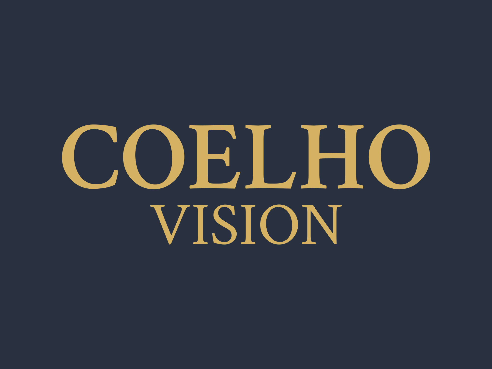

<p align="center"></p>

<p align="center"><strong>Five Computer Vision backbones, fifteen live capabilities, one Streamlit app — plus a native Windows build for when the browser isn't fast enough.</strong></p>

<p align="center">
  <a href="https://www.python.org/"></a>
  <a href="https://streamlit.io/"></a>
  <a href="https://opencv.org/"></a>
  <a href="https://docs.ultralytics.com/"></a>
  <a href="https://developers.google.com/mediapipe"></a>
  <a href="https://roboflow.com/"></a>
  <a href="https://docs.openvino.ai/"></a>
</p>

<p align="center">
  <a href="https://coelhovision.streamlit.app/">Live Demo</a> ·
  <a href="https://rafaelcoelho.pages.dev/work/coelho-vision">Portfolio Page</a> ·
  <a href="./COELHOVISION.pdf">PDF Presentation</a>
</p>

---

## Table of Contents

- [What is this?](#what-is-this)
- [The four pages](#the-four-pages)
- [Every capability, by page and backbone](#every-capability-by-page-and-backbone)
- [Why five backbones instead of one](#why-five-backbones-instead-of-one)
- [Tech Stack](#tech-stack)
- [Key Components](#key-components)
- [Shipped but disabled](#shipped-but-disabled)
- [Related: native Windows build](#related-native-windows-build)
- [Prerequisites](#prerequisites)
- [Installation](#installation)
- [Project Structure](#project-structure)
- [Author](#author)

---

## What is this?

COELHO VISION is a Computer Vision platform that doesn't commit to a single model family. Instead, each of its fifteen live capabilities picks whichever backbone actually wins that capability's accuracy-vs-latency trade-off — classical Haar cascades where a neural net is overkill, MediaPipe where real-time on-device inference matters, OpenVINO where CPU-only latency is the constraint, YOLO and RoboFlow-hosted models where detection accuracy is the point. All of it runs against a static image upload, a camera snapshot, or a live WebRTC video stream, from the same Streamlit interface.

The platform is **publicly live** at [coelhovision.streamlit.app](https://coelhovision.streamlit.app/) — no setup required to verify any of the claims below, just a browser and (for Live Camera) a webcam.

## The four pages

| Page | What it groups | Input modes |
|---|---|---|
| **Object Detection** | Face detection, object detection, image classification, object tracking | Camera snapshot or image upload |
| **Image Segmentation** | Pixel-level segmentation, depth estimation | Camera snapshot or image upload |
| **Pose Estimation** | Gesture recognition, hand landmarks, full-body pose | Camera snapshot or image upload |
| **Live Camera** | All three task types above, re-run per video frame | Live WebRTC stream (`streamlit-webrtc`, STUN-based peer connection) |

## Every capability, by page and backbone

| Capability | Backbone | Notable detail |
|---|---|---|
| Full Face Detection | OpenCV Haar cascades | Three independent classical classifiers (face, eyes, mouth) with live-tunable scale-factor / min-neighbor sliders per detector — no neural net involved |
| Object Detection | Ultralytics YOLOv8 (`yolov8n`) | |
| Object Detection | MediaPipe (EfficientDet-Lite0) | Model auto-downloaded on first use if not cached locally |
| Image Classification | MediaPipe (EfficientNet-Lite0) | Top-4 class probabilities rendered as live metrics |
| Face Detector | MediaPipe (BlazeFace short-range) | Draws bounding box, confidence, and facial keypoints |
| Object Detection | RoboFlow hosted inference (`yolov8n-640`) | Calls RoboFlow's `inference` SDK rather than running the model locally |
| Object Tracking | RoboFlow + `supervision` ByteTrack | Persistent numbered tracker IDs across frames, with motion trace annotation |
| Image Segmentation | Ultralytics YOLOv8-seg | |
| Image Segmentation | MediaPipe (DeepLabV3) | User-configurable foreground/background mask colors |
| Depth Estimation | OpenVINO (MiDaS small) | Monocular depth, viridis colormap output |
| Image Segmentation | OpenVINO (road-segmentation-adas-0001) | |
| Gesture Recognition | MediaPipe Gesture Recognizer | Per-gesture confidence rendered as live metrics |
| Hand Landmarker | MediaPipe (2-hand landmark model) | Full landmark skeleton with handedness (left/right) labeling |
| Pose Estimation | MediaPipe Pose Landmarker (heavy) | |
| Pose Estimation | OpenVINO (human-pose-estimation-0001) | Bottom-up multi-person estimation via a hand-implemented Part Affinity Field decoder (`decoder.py`) — not a wrapper call, an actual from-scratch port of the OpenPose keypoint-grouping algorithm |

Every capability above runs in all three static-input pages; Live Camera re-exposes the same backbones (minus MediaPipe Image Classification) against a live video feed via a single per-frame callback.

## Why five backbones instead of one

A single CV backbone would be simpler to maintain, but it loses real capability:

- **Real-time pose/gesture on CPU** — MediaPipe is purpose-built for it; a heavier detector would cost fps for no accuracy gain here.
- **Classical operations that don't need a neural net** — Haar cascades for face/eye/mouth detection are faster and require zero GPU/model download.
- **CPU-only latency-sensitive inference** — OpenVINO's `PERFORMANCE_HINT: LATENCY` compilation mode targets exactly this, used for depth estimation and both segmentation and pose alternatives.
- **Hosted vs. local trade-off** — RoboFlow's inference API means detection and tracking work without a local GPU at all.
- **Swap-ability** — when a new SOTA detector ships, one backbone changes; the other fourteen capabilities are untouched.

## Tech Stack

| Technology | Role |
|---|---|
| **Streamlit** + **streamlit-webrtc** | UI shell, camera/file input, live video streaming |
| **OpenCV** | Classical CV ops (Haar cascades), image I/O and color conversion throughout |
| **Ultralytics YOLOv8** | Object detection and instance segmentation |
| **MediaPipe** | 7 of the 15 capabilities — detection, classification, segmentation, gesture, hand and pose landmarks |
| **RoboFlow** (`inference`, `supervision`) | Hosted detection + ByteTrack multi-object tracking |
| **OpenVINO** | CPU-optimized depth estimation, segmentation, and pose estimation |
| **TensorFlow** | Present for the disabled VGG16 path (see below) |

## Key Components

### The from-scratch OpenPose decoder

`decoder.py` implements the OpenPose bottom-up pose estimation algorithm's keypoint-grouping stage by hand — heatmap non-max suppression, Part Affinity Field-based limb scoring, connection NMS, and pose-entry merging, ported from OpenVINO's own reference implementation. This is the piece that turns raw model output (heatmaps + PAFs) into actual labeled skeletons; it's real algorithmic work, not a thin call into a pre-built decoder.

### On-device model management

Every MediaPipe and OpenVINO capability downloads its own model file on first use (`urlretrieve` from Google's / Intel's public model storage) into a local `models/` directory, then reuses it on subsequent runs — no manual model management step in the install instructions below.

### Mode × Role composition

Every page separates *mode* (Camera snapshot vs. Image upload) from *role* (which backbone/capability runs) as two independent selectors, so switching capabilities never requires re-uploading the input.

## Shipped but disabled

**Image Classification (VGG16)** is fully implemented in `pages/object_detection.py` (commented out) — a commit message in this repo's history notes it was disabled specifically *"to avoid memory [causing the app] to crash"*, almost certainly on Streamlit Community Cloud's free-tier memory ceiling. The code runs standalone; re-enabling it is an uncomment, not a rewrite.

## Related: native Windows build

A companion repository, [**COELHOVISIONEXE**](https://github.com/rafaelcoelho1409/COELHOVISIONEXE), packages this capability set as a native Windows desktop app (PyInstaller), built specifically to cut the latency the browser/WebRTC path can't avoid — and adds at least one capability not present here: Optical Character Recognition. Linux/macOS users run this repository directly instead — there's no compiled build for those platforms.

## Prerequisites

| Requirement | Notes |
|---|---|
| **Python** 3.10+ | |
| **libgl1-mesa-dev**, **libglib2.0-0** | OpenCV's system-level dependencies (see `packages.txt` — this is the exact apt package list Streamlit Community Cloud installs before running the app) |
| A webcam | Only needed for Live Camera and Camera-mode input on the other pages |

## Installation

```bash
git clone https://github.com/rafaelcoelho1409/COELHOVISION
cd COELHOVISION

# System dependencies (Debian/Ubuntu — see packages.txt)
sudo apt-get install -y libgl1-mesa-dev libglib2.0-0

python -m venv .venv
source .venv/bin/activate
pip install -r requirements.txt

streamlit run home.py
```

Model weights for MediaPipe and OpenVINO capabilities download automatically on first use of each — no separate download step.

## Project Structure

```
COELHOVISION/
├── home.py                       # Landing page — feature showcase, Windows build link
├── functions.py                   # Shared UI helpers + all 16 CV backbone classes
├── decoder.py                     # Hand-implemented OpenPose PAF/heatmap decoder
├── pages/
│   ├── object_detection.py         # Face/object/classification/tracking roles
│   ├── image_segmentation.py       # Segmentation + depth estimation roles
│   ├── pose_estimation.py          # Gesture/hand/pose roles
│   ├── live_camera.py              # WebRTC live video, all task types
│   └── about.py                    # Author info
│
├── data/                          # Haar cascade XML files (face/eye/mouth)
├── assets/                        # Logo + demo screenshots
├── .streamlit/config.toml          # Dark theme, static serving
├── packages.txt                   # System (apt) dependencies for Streamlit Cloud
├── requirements.txt
└── COELHOVISION.pdf                # Deployment record / demo deck
```

## Author

**Rafael Coelho** — [rafaelcoelho.pages.dev](https://rafaelcoelho.pages.dev/)
